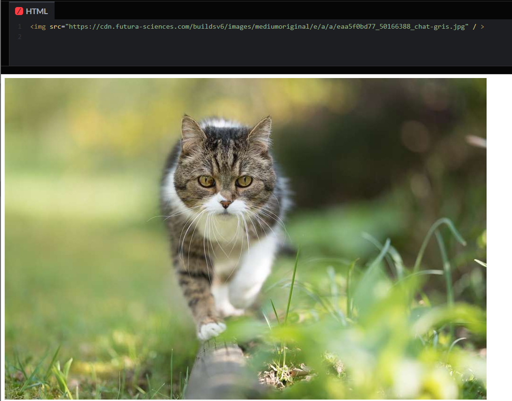

# Insertion de different médias en html
>Premièrement, le HTML est un language de balisage. Il sert à la mise-en-forme du contenu d'une page web en utilisant des balises semantics pour donner un sense aux differents composants de la page. Il existe aussi des balises non-semantic, mais dans le contexte ici ne nous sera pas utile.

>Il existe plusieurs type de balise et nous allons nous interresser à trois balise en particulier dans le but d'inserer des images, vidéos et bandes sonores à une page web.
* `< img/ >`
* `< video >`
* `< audio >`

## Insertion d'une image/gif
### La balise < img/ > est auto-fermante (self-closing tag)

#### Cette balise peut contenir plusieurs attributs, mais `src` est la seul qui est essentiel.
> Elle va servire à donner le chemin d'accès pour retrouver l'image qui sera inserée à la page.
### La balise devrait resembler a ceci avec son attribut `src` .

  

### Il existe d'autre attributs pour la balise `< img/ >`
* `alt`
* `title`
* `height`
* `width`

### L'attribut `alt` signifie text-alternatif en cas ou l'image n'est pas affiché. Il sert a décrire la photo et a aussi deux fonctions principales importantes.
1. Être lu par un lecteur d'écran pour les personnes avec des un problème de vision.
2. Être indexer par les moteurs de recherche.

#### La balise avec son attribut `alt` va ressembler a ceci.
``

## Insertion d'un vidéo

## Insertion d'une bande sonore

