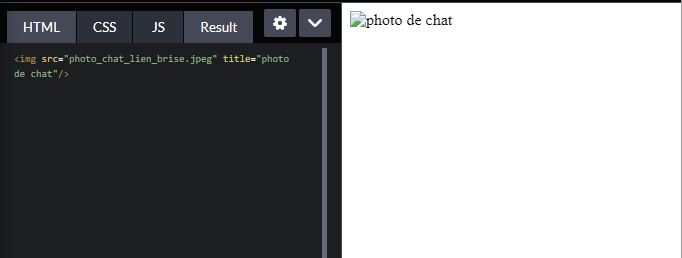
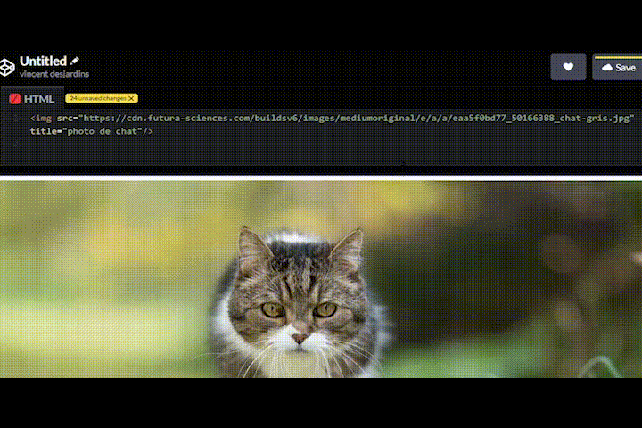
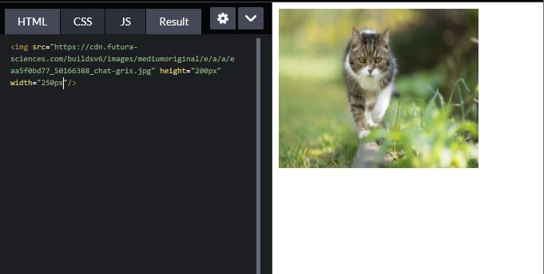
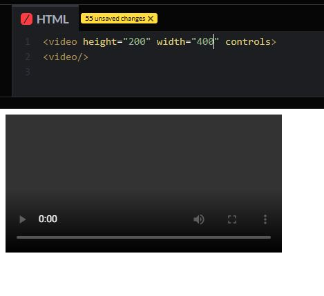
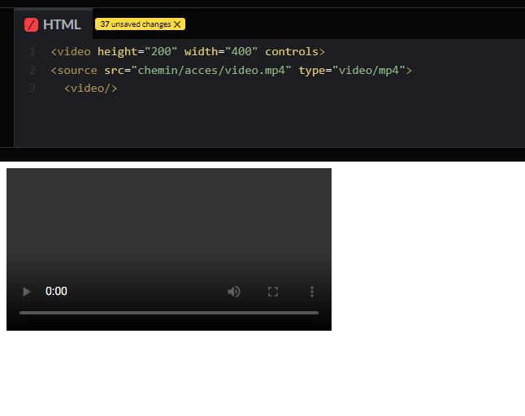

# Insertion de différent médias en html
>Premièrement, le HTML est un language de balisage. Il sert à la mise en forme du contenu d'une page web en utilisant des balises semantics pour donner un sens aux différents composants de la page. Il existe aussi des balises non-semantic, mais dans le contexte ici ne nous sera pas utile.

>Il existe plusieurs types de balise et nous allons nous interrésser à trois balises en particulier dans le but d'inserer des images, vidéos et bandes sonores à une page web. Nous allons aussi nous intéresser à quelques un de leurs attributs.
* `< img >`
* `< video >`
* `< audio >`

## Insertion d'une image/gif
### La balise < img > est auto-fermante (self-closing tag)

#### Cette balise peut contenir plusieurs attributs, mais `src` est la seule qui est essentielle.
> Elle va servir à donner le chemin d'accès pour retrouver l'image qui sera insérée à la page.
### La balise devrait resembler a ceci avec son attribut `src` .

  

### Il existe d'autre attributs pour la balise `< img >`
* `alt`
* `title`
* `height`
* `width`

### L'attribut `alt` signifie text-alternatif en cas ou l'image n'est pas affiché. Il sert a décrire la photo et a aussi deux fonctions principales importantes.
> 1. Être lu par un lecteur d'écran pour les personnes avec des un problème de vision.
> 2. Être indexer par les moteurs de recherche.

 La balise avec son attribut `alt` va ressembler à ceci.
``

 
 
### L'attribut `title`
 >`title` sert à créer une bulle d'aide qui va apparaitre au survol de l'image

 La balise avec son attribut `title` va ressembler à ceci. ``
 
 

### Les attributs `height` et `width` vont spécifier la grandeur de l'image.
> Ces deux balises vont permettre de choisir la grandeur de l'image. Leur utilisation est simple, il suffit juste d'écrire les dimensions voulues (en px, %, em, rem...)

La balise avec son attribut `height` et `width` va ressembler à ceci. ``

 
## Insertion d'un vidéo
### Contrairement à la balise `< img >`, la balise `< video >` n'est pas auto-fermante.
#### Pour le bon fonctionnement, on doit inclure dans la balise ouvrante les attributs `height` et `width`, ainsi que l'attribut `controls`.
> Les attributs `height` et `width`, vont servir à spécifier la grandeur à laquelle le vidéo sera présenté sur la page web.

> L'attribut `Controls` va venir ajouter les commandes pour démarer ou arrêter la video.

### Ensuite on doit ajouter la source du vidéo.
> Elle va spécifier le chemin d'accès au vidéo et son attribut `type` va indiquer au navigateur qu'elle format vidéo s'agit-il.

`< source src="le/chemin/accès/video.mp4" type="video/mp4">`

